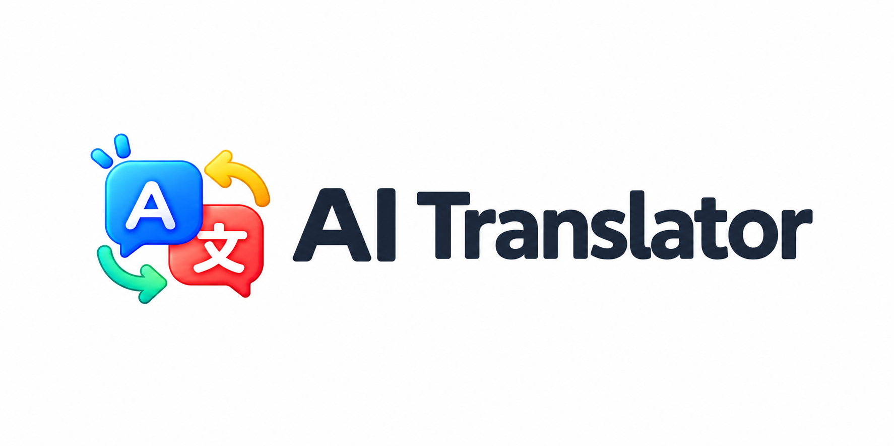

# AI Translator

**輸入文字，選擇語言，讓 AI 幫你快速翻譯！**

AI Translator 是一個使用 Gemini API 的翻譯網站。使用者可以自行輸入 Gemini API KEY，選擇來源與目標語言，並在瀏覽器中完成文字翻譯、語音輸入與語音輸出。



## 功能

- 使用者需要自行填入 Gemini API KEY
- API KEY、模型、語言、日文讀音和主題設定會保存於瀏覽器
- 模型支援 Gemini 3.1 Flash Lite、Gemini 3.5 Flash Lite、Gemini 2.5 Flash、Gemini 3 Flash、Gemini 3.5 Flash
- 輸入語言支援任意語言
- 輸出語言支援繁體中文、簡體中文、英文、日文、韓文
- 日文翻譯可選擇是否在漢字後加入讀音標註
- 麥克風語音輸入，依選定的輸入語言進行辨識
- 喇叭語音輸出，依選定的輸出語言進行播放
- 可編輯輸入與輸出文字
- 交換輸入與輸出內容
- 複製輸出內容
- 清除輸入與輸出內容
- 保存最近十筆翻譯紀錄，可點擊紀錄重新載入
- 淺色與深色主題
- 桌機左右排列，手機上下排列

## 開始使用

### 環境需求

- Node.js 20 或更新版本
- 支援 JavaScript 的現代瀏覽器
- 使用語音輸入時，瀏覽器需要支援 Web Speech API，並允許麥克風權限

### 安裝與啟動

```bash
npm install
npm run dev
```

啟動後，開啟終端機顯示的本機網址，通常是 `http://localhost:5173/`。

### 建置正式版本

```bash
npm run build
```

建置完成的檔案會輸出至 `dist/`。

預覽正式版本：

```bash
npm run preview
```

## 使用方式

1. 點擊右上角設定按鈕。
2. 開啟 [Google AI Studio](https://aistudio.google.com/apikey)，建立或取得 Gemini API KEY (免費版即可)，貼回設定視窗。
3. 選擇模型與翻譯語言。
4. 輸入文字，或點擊麥克風按鈕使用語音輸入。
5. 點擊翻譯按鈕取得翻譯結果。
6. 使用輸出框右側的喇叭按鈕播放翻譯結果。
7. 使用交換、複製或清除按鈕處理文字內容。
8. 點擊右上角翻譯紀錄按鈕，可查看並重新載入最近十筆紀錄。

## API KEY 與隱私

- Gemini API 呼叫由瀏覽器直接發送，專案沒有後端代理伺服器。
- API KEY 會保存在目前瀏覽器的 localStorage，請勿在共用或不受信任的裝置上使用個人 API KEY。
- API KEY 會透過 HTTPS API 請求傳送至 Google Gemini API，不會寫入專案檔案或提交到 Git。
- 清除瀏覽器網站資料可以移除保存的 API KEY、偏好設定與翻譯紀錄。

## 技術架構

- React 19
- TypeScript
- Vite
- Bootstrap Icons
- Gemini Generative Language API
- Web Speech API：`SpeechRecognition`／`webkitSpeechRecognition` 與 `speechSynthesis`

## 專案結構

```text
.
├── index.html
├── public/
│   └── favicon.svg
├── src/
│   ├── App.tsx
│   ├── main.tsx
│   └── styles.css
├── package.json
└── vite.config.ts
```

## 授權

本專案目前未另外指定開源授權。使用前請確認 Gemini API 與 Google AI Studio 的相關使用條款。

本網站由 Copilot Agent 協助開發，如果有遇到問題或需要改進的地方，歡迎提出 Issue 或 Pull Request！

---

<div align="center">
<sub>Last updated: 2026/09/04</sub>  

<sub>Copyright © 2026 Andy Chiang</sub>
</div>
